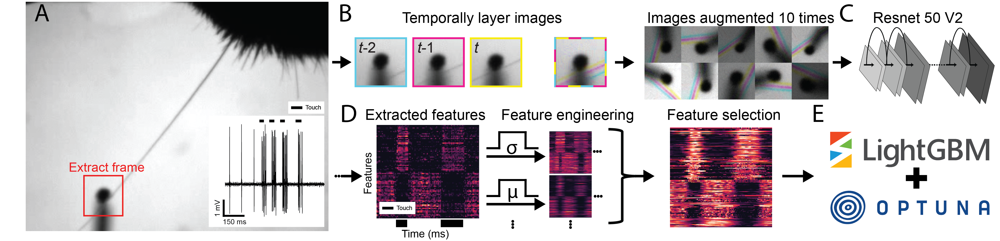
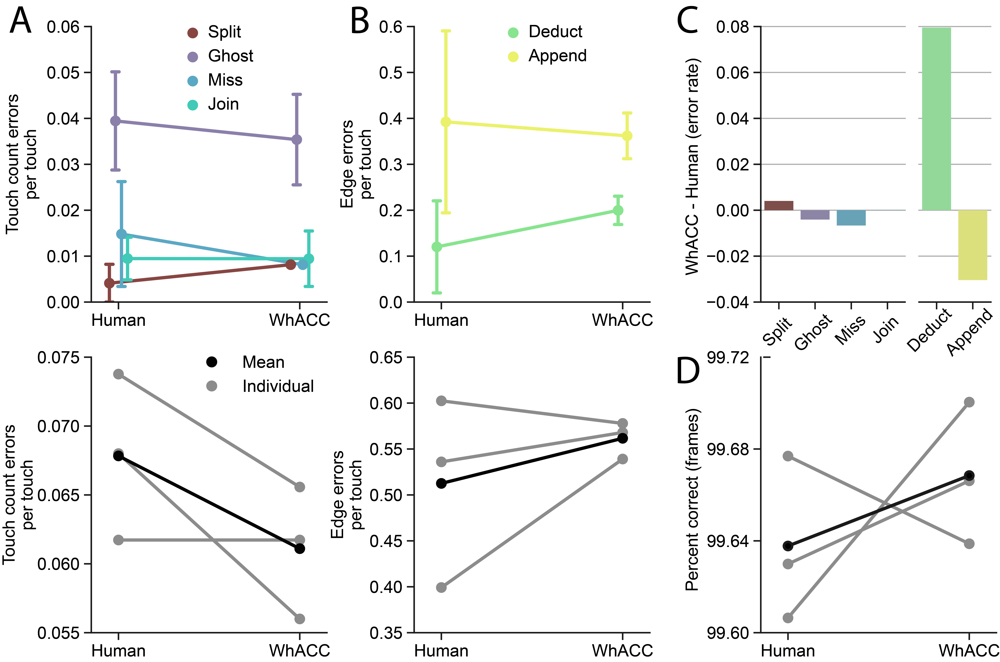

  

WhACC is a tool for automated touched image classification. 

Many neuroscience labs (e.g. [Hires Lab](https://www.hireslab.org/)) use tasks that involve whisker active touch against thin movable poles to study diverse questions of sensory and motor coding. Since neurons operate at temporal resolutions of milliseconds, determining precise whisker contact periods is essential. Yet, accurately classifying the precise moment of touch is time-consuming and labor intensive. 

## [Walkthrough: Google CoLab](https://colab.research.google.com/drive/1HqkzE-Wih89DKwrOWplp58UrbNMP1KPS?usp=sharing)

  
*Single example trial lasting 4 seconds. Example video (left) along with whisker traces, decomposed components, and spikes recorded from L5 (right). How do we identify the precise millisecond frame when touch occurs?*

## Flow diagram of WhACC video pre-processing and design implementation

  

## Touch frame scoring and variation in human curation

  

## Feature engineering and selection

  

## Data selection and model performance

  

## WhACC shows expert human level performance

  

## Code contributors:
WhACC code and software was originally developed by Phillip Maire and Jonathan Cheung in the laboratory of [Samuel Andrew Hires](https://www.hireslab.org/). 
